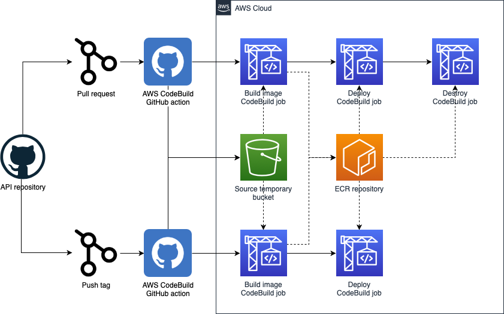
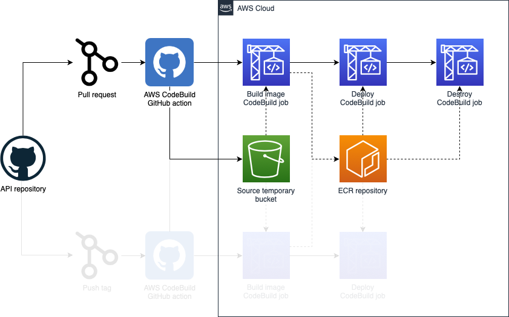
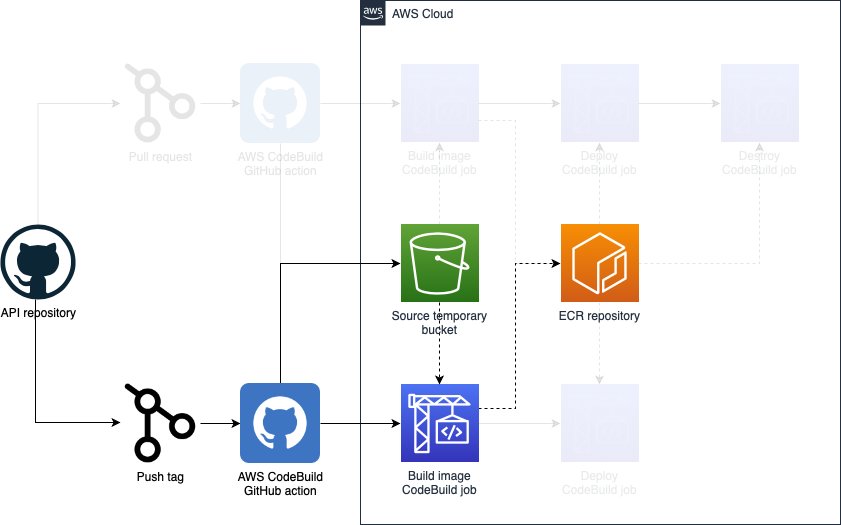
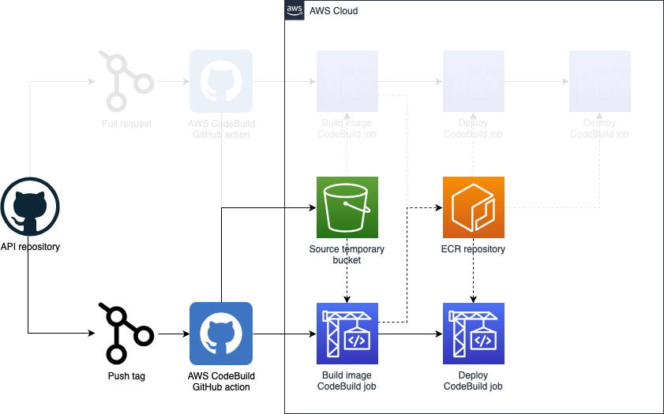

# CI/CD for the repository

&#x2B11; [Return to index](../README.md)

This document explains how CI and CD are designed for this project as well as some details on the resources and infrastructure used for that.

- [CI/CD for the repository](#cicd-for-the-repository)
  - [Description](#description)
  - [Continuous Integration](#continuous-integration)
  - [Continuous Delivery](#continuous-delivery)
  - [Continuous Deployment](#continuous-deployment)
  - [References](#references)

## Description

In order to cover **Continuous Integration**, **Continuous Delivery** and **Continuous Deployment**, we are essentially building a docker image containing all the code to be deployed within all needed dependencies in a specific point in time, so they are potentially releaseble at any time with inmutability.

Regarding Continuous Integration, we also have here some other workflows with minimal sanity checks and other advanced quality analysis:

- **Pre-commit hooks**: this workflow essentially will ensure that pre-commit hooks are also executed when the developer create a PR, since the installation of pre-commit in the local repository requires developer actions and cannot be forced. See [current pre-commit hooks](development.md#pre-commit) for more details.
- **Run unit tests**: This workflow will run unit tests in the repository as well as compute code coverage of the tests.
- **Sonar Cloud analysis**: This workflow will run code static analysis using Sonar Cloud.
- **Build and deploy checks**: This workflow is the more complicated one and we are going to dig into its details in the next sections.

For the build and deploy checks we need some extra infrastructure resources. Here you will find a summarized description of the extra resources provisioned and the workflow followed in each case.

Let's see how it works in each case.

## Continuous Integration

In order to enable a proper integration of new code to the main branch and therefor to potentially new releases, we need to have some sort of mechanisms to test that integration of the code. Some of those mechanisms are done directly with GitHub workflows, but there is still other checks that needs more complex process to complete. This is going to be triggered on each pull request against the main branch.

As mentioned before, we are building a docker image to be used to deploy our code afterwards, so we need to also check:

- Image is still buildable
- The code in the image can be deployed

So, we are going to incorporate to our CI the necessary resources to accomplish it:

As you can see, at the end, we also have a destroy step, since this is only to test, we need to teardown also the infrastructure provisioned after tests are done.

## Continuous Delivery

Once our code is integrated with the main branch, we want to create such a potentially releaseable "artifact", which essentially is going to be our docker image with a specific tag. I have choosen to do that according to git tags, so this is going to be triggered on each tag push.

## Continuous Deployment

Similary to the previous step, we can also automatically deploy the produced artifact into some kind of integration or testing environment stage, so we can start doing proper end to end tests, test integration with other systems or even present the result to other stakeholders/customers for approval.

## References

- [Serverless guru code challenge CI/CD infra](https://github.com/neovasili/serverless-guru-code-challenge-cicd-infra)
- [AWS Codebuild GitHub action](https://github.com/neovasili/aws-codebuild)
