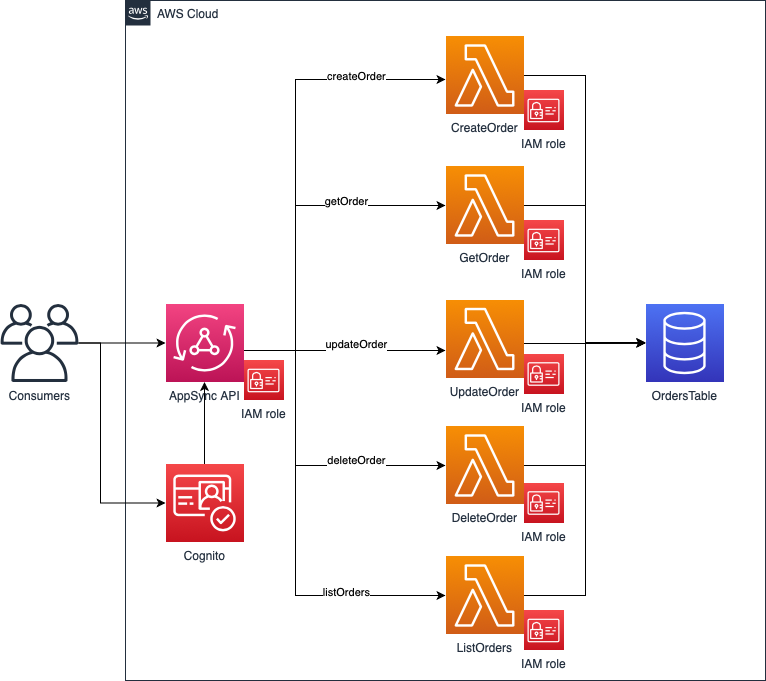

# Solution

&#x2B11; [Return to index](../README.md)

Here you could find full explanation of the solution implemented.

- [Solution](#solution)
  - [Description](#description)
  - [Design of the solution](#design-of-the-solution)
    - [AppSync API](#appsync-api)
    - [CreateOrder lambda function](#createorder-lambda-function)
    - [GetOrder lambda function](#getorder-lambda-function)
    - [UpdateOrder lambda function](#updateorder-lambda-function)
    - [DeleteOrder lambda function](#deleteorder-lambda-function)
    - [Cognito User Pool](#cognito-user-pool)
    - [Cognito User Pool App Client](#cognito-user-pool-app-client)
    - [Orders DynamoDB table](#orders-dynamodb-table)
  - [Implementation details](#implementation-details)
    - [Python requirements](#python-requirements)
    - [Local arguments and base paths interpolations](#local-arguments-and-base-paths-interpolations)
    - [Serverless packaging configuration](#serverless-packaging-configuration)
    - [Code structure](#code-structure)
    - [Model Helper. Road to no-ORM](#model-helper-road-to-no-orm)

## Description

In these current chaotic and overwelming times of pandemic and digital revolution, one of the sectors that has grown more is the home delivery and specifically, the quick service restaurants home delivery.

Applications like Uber, Just eat and Glovo have become important for that purpose so good designs and architectures have been critical for scalability an reliability during this unforeseen expansion.

GraphQL and serverless are good technologies to make this possible, so le'ts build with them!

The solution presented in this repository will try to cover the creation of a GraphQL API using serverless and AppSync to manage the creation of restaurants orders as well as managing their lifecycle.

## Design of the solution

Here is a high level diagram of the solution design:



So, we will create the following resources.

### AppSync API

Containing the schema definition for the GraphQL API including integration with lambda resolvers, its own IAM role (with proper permissions to invoke those lambdas) and integration with AWS Cognito for authentication and authorization.

### CreateOrder lambda function

With the responsability to receive the request to create a new Order and store it. Definition of a specific role for this lambda to read and write items from DynamoDB (a part from basic permissions), is included.

### GetOrder lambda function

With the responsability to receive the request to get detailed data from an existing Order. Definition of a specific role for this lambda to read items from DynamoDB (a part from basic permissions), is included.

### UpdateOrder lambda function

With the responsability to receive the request to update some data from an existing Order, including a full update as well as specific operations to control the lifecycle of an Order:

- acceptOrder -> The restaurant have received the order and can process it, so it's accepted
- startCookingOrder -> The restaurant have started to prepare the order
- readyToDeliverOrder -> The order is prepared and ready for a rider to pick up
- onRouteOrder -> The order have been picked up by a rider and is on route to the customer
- deliveredOrder -> The order have been delivered to the customer
- cancelOrder -> The order have been cenceled by the customer or the restaurant
- deleteOrder -> The order have been deleted from the system by an administrator or authorized operator

Definition of a specific role for this lambda to read and write items from DynamoDB (a part from basic permissions), is included.

### DeleteOrder lambda function

With the responsability to receive the request to delete some data from an existing Order. Definition of a specific role for this lambda to read and delete items from DynamoDB (a part from basic permissions), is included.

### Cognito User Pool

Containing the definition of the user pool for the system. In order to access to the API, an user should exists and be validated in the user pool.

### Cognito User Pool App Client

Containing the definition of the conector that will act as identity broker from the API and the user pool.

### Orders DynamoDB table

Containing the definition of the table where the orders data will be stored, retrieved and eventually deleted from.

## Implementation details

Here, you will find some highlight points regarding implementation of the solution, with some extra explanations.

### Python requirements

The selected language for this implementation was python, and for that purpose, we have the `serverless-python-requirements` plugin that will essentially let us define a lambda layer that will be automatically packaged with the contents specified in the `requirements.txt` file.

Also, that layer package porocess can be configured to be done only when the plugin detect changes in the requirements file and use previously packaged cache if exists.

However, it's also important to say that, latest versions of serverless framework have been causing some sort of uncompatibility with the plugin that "broke" `serverless deploy -f ...` so, only a full deploy can be used until this is solved. Here is an [issue where this is reported](https://github.com/UnitedIncome/serverless-python-requirements/issues/414).

### Local arguments and base paths interpolations

Usually, all software development projects are done by teams of developers, and also, you will find the need to support multiple stages of the code with different purposes. In serverless, this is not a different thing, in fact, is much more important to have a reliable setup that allows you work in such conditions smoothly. For example, here you have one strategy to use for this:

- AWS Dev account, where all developers have it's own isolated resources to work with
- AWS INT account, where code is automatically deployed after is considered potentially releaseable; you can perform some e2e and/or integration tests
- AWS QA account, where code is promoted (automatically or manually) to perform load, security and performance tests
- AWS PP (pre-production) account, where code is promoted (automatically or manually) to perform acceptance tests, demos to customer or similar tests
- AWS PRD account, where code is promoted and exploited for production purposes

In the scope of how to work with this sceneario/strategy, you can also consider:

- Use git repositories
- Use feature branch approach
- Use Pull Requests to integrate changes to the main branch
- Run CI jobs/pipelines on PR in order to reduce uncertainty of failure once the code is integrated
- Merge changes to main branch once PR is approved and CI is "green"
- Create tags for potential releases using semantic versioning in the main branch; can contain multiple PR merges, even though, small and frequent releases are recommendable
- Automatically deploy to a "safe" integration stage environment on tag release create performing integration/e2e tests
- Plan for promotion of code for further stages according to business needs

Having said all that, the serverless configuration file includes a set of custom variables that are used to compose others, in order to minimize duplication of patterns definition for naming or reference of resources. Also, we will be playing with two main variables: `stage` and `prefix` in order to be able to deploy the serverless stack in multiple stages idempotently wihtou interfering other stacks, speecially in DEV with multi developers stacks.

Another important highlight on this is the `custom.arguments` parameter, which is fed from a local file which is ignored in git repository, so needs to be defined by each developer, with the benefit, that once it's defined, development process is easier, you don't need to worry about setting up environment variables or arguments each time you are going to develop. Let's see it with an example:

```yaml
---
stage: ${opt:stage, "dev"}
region: ${opt:region, "eu-west-1"}
prefix: ${env:PREFIX, "jmr"}
account: ${env:AWS_ACCOUNT_ID, "744489383813"}
api_version: ${env:API_VERSION, "v1"}
```

So, we are defining a default value for arguments `stage` and `region` to avoid doing `sls deploy --stage xxx` each time we need to. Also, we are defining some custom environment variables to use and its default value for this developer, where `prefix` become the most important one, because we are using an acronim of developer name, so all resources are going to be created from that prefix for this specific developer.

### Serverless packaging configuration

One thing which is important and I saw a lot fo developers forgetting it, is to minimize the package size of our lambda functions as well as putting there only which is strictly necessary to make them work.

For that purpose, serverless framework have an amazing option to define a global package configuration (each lambda will include files defined there) and at the same time a pakcage configuration per lambda function, so you can define in the global block, common files and in the individual ones, only the function specific ones.

That way, lambda packages are quite small (between a hundred of Bytes and some KBs) improving provisioning times.

### Code structure

SOLID principles can be applied in a huge amount of circumstances, and specially when organizing code structure, the way that you decouple interfaces in the code from concrete implemntations or responsabilities, and keep extensibility easy.

I usually use this folders structure approach:

```txt
├── resources
│   └── infrastructure
├── src
│   ├── controller
│   ├── handler
│   ├── helper
│   ├── model
│   └── service
└── tests
    └── unit
```

Where those contains the following:

- `resources/infrastructure`: CloudFormation resources not managed directly by serverless framework definition, such as DynamoDB tables or Cognito User Pools
- `src/controller`: Controller classes to manage business logic of the system or to work as wrappers for specific implementations of some services
- `src/handler`: Handler classes with the specific code of lambda functions with the purpose of getting input and environment variables, delegate logic to controllers, and produce outputs
- `src/helper`: Helper classes to ease common operations for instance with timestamps, text processing... etc.
- `src/model`: Model classes for systme entities modeling
- `src/service`: Service classes for agnostic interation with external systems/resources, such as database storage
- `tests/*`: TestCases folder for unit/integration and/or e2e tests

### Model Helper. Road to no-ORM

Usually, people use ORM to map entity data into databases, but with boto3 and python, is really easy to directly map native python dictionaries with DynamoDB objects.

With this class that I've been using across multiple projects, is really easy to apply some tipical ORM validations to any class that inherits from it:

```python
class Order(ModelHelper):
    """
    Model class to define Orders
    """

    def __init__(self, input_parameters: dict):
        self.__status = self.get_value(
            input_object=input_parameters,
            input_object_property_name="status",
            default_value=OrderStatus.PENDING,
            allowed_values=OrderStatus.__dict__.values(),
        )

        {...}

        self.__order_id = self.get_value(
            input_object=input_parameters,
            input_object_property_name="order_id",
            mandatory=True,
        )
```

In this excrept from the Order model class, you can see, that just using the `get_value` method, you can specify which parameter to retrieve from input,, a default value, allowed values set, and if it's mandatory or not.

Another big benefit, is the `get_model_dict` method which is used to retrieve a "clean" dictionary from an object and its attributes, even with them are private. This is really useful, when you need to parse from entire python objects to json and viceversa, which is a typical operation in the APIs world.
